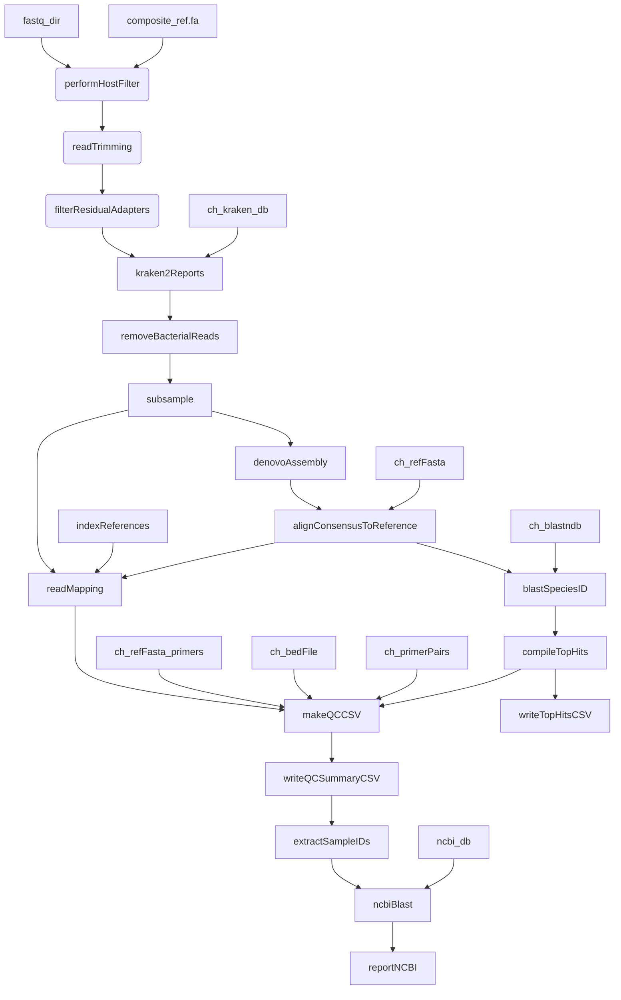

# tick-COI-amplicon-illumina-nf
This bioinformatics pipeline is based on the BCCDC-PHL/ncov2019-artic-nf pipeline (https://github.com/BCCDC-PHL/ncov2019-artic-nf), with modifications specific to the assembly methods (in this case, de novo assembly). This pipeline has been adapted to support analysis of tick identification, specifically Ixodes and Dermacentor, by cytochrome oxidase subunit I (COI) targeted sequencing (amplicon size: 658 bp). 

The bioinformatics pipeline builds a consensus sequence using de novo assembler SPAdes from Illumina paired-end reads. This COI sequence is then used to blast against an in-house curated Ixodes/Dermacentor database (v1.0). Note: Prior to assembly, there are additional steps that remove  any human reads (using a mapping of the reads to a human reference genome), followed by removal of bacterial reads (using Kraken2 and KrakenTools). Any consensus sequences with poor matches (<97% sequence identity) to our in-house database are blast against NCBI database. 



#### Usage
```
  Usage:
    nextflow run BCCDC-PHL/tick-COI-amplicon-illumina-nf -profile conda --cached ~/.conda/envs --prefix [prefix] [workflow-options]

  Description:
    Turn Illumina sequencing reads into consensus sequences

  Nextflow arguments (single DASH):
    -profile                      Allowed values: conda

  Workflow options:
    Mandatory:
      --prefix                    A (unique) string prefix for output files.
                                  Sequencing run name is a good choice e.g DDMMYY_MACHINEID_RUN_FLOWCELLID.
      --directory                 Path to a directory containing paired-end Illumina reads.
                                  Reads will be found and paired RECURSIVELY beneath this directory.
      --db                        Path to blastn database (e.g., in-house tick COI database or supply your specific database)
      --kraken_db                 Path to kraken2 database
      --ncbi_db                   Path to ncbi database
      --outdir                    Output directory (Default: ./results)
      --bed                       Path to primer bed file, also requires --ref-with-primers
      --ref                       Path to reference fasta file (without primers)
      --ref_with_primers          Path to reference fasta file (with primers), also requires --bed
      --primer_pairs_tsv          File showing which primers are paired.
      --composite_ref             Human_and_composite_ref sequence
    Optional:
      --length                    Threshold for keeping contigs from denovoAssembly (default:600)
      --subsampleReads            Number of reads to downsample (default: 1000)
      --max_target_seqs_blast     Number of maximum target sequences as output using blast (default: 100)
```
